Data Science 871 project
================

## Media Consumption and Willingness to upgrade internet package.

The purpose of this project is to use survey data in order to determine
which factors are important predictors of whether individuals would be
willing to upgrade their internet packages. All code and functions are
stored under the ‘code’ folder. This readme is solely for visualization
of data and results. The formal pdf can be found in
‘bin/DataScienceProject_RuanGeldenhuys.pdf’.

## Data loading and cleaning

The data set contains survey responses from 2131 individuals regarding
demographic factors (age, sex, race, ect.), the types of apps they use,
time spent on different devices, preferred type of media, and other
issues regarding media consumption. I restrict this data set to include
only responses from individuals that have internet access.

The features can be broadly broken down into 6 categories, namely
demographic factors, technology owned by individuals, device usage, app
usage, user subscriptions and lastly, what individuals’ preferred form
of entertainment are.

``` r
NAs <- 0
for (i in 1:nrow(appDF)) {
    if (any(appDF[i,] == "#NULL!") == TRUE) {  #Checking how many users did not answer this question
        NAs <- NAs + 1
    }
}
NAs
```

    ## [1] 412

Under closer inspection it would appear that a total of 412 survey
respondents did not answer the question regarding app usage. Thus, for
now, I exclude this feature from further analysis. Additionally, I
exclude any individuals who do not have an internet connection as they
serve no purpose in determining the target variable of upgrading
internet.

\##Target Variable The target variable is turned into a factor variable
indicating a 1 if they are willing to upgrade their internet package and
a 0 if they are not.

``` r
Q29 <- masterDF[,151]

UpgradeInternet <- ifelse(Q29 == "I am not willing to pay more for faster download speeds as my current speed is sufficient for my needs" |
                  Q29 == "I prefer faster speed but I am unwilling to pay more than I already do", 0, 1)
UpgradeInternet <- as.factor(UpgradeInternet)
head(UpgradeInternet)
```

    ## [1] 1 1 1 0 1 1
    ## Levels: 0 1

``` r
summary(UpgradeInternet)
```

    ##   0   1 
    ## 814 744

In total 814 respondents indicated that they will not be willing to
upgrade their internet package, while 744 respondents would.

## Exploratory Data analysis

### Demographics

Below are breakdowns of the demographic factors of the dataset.

``` r
demogPlot
```

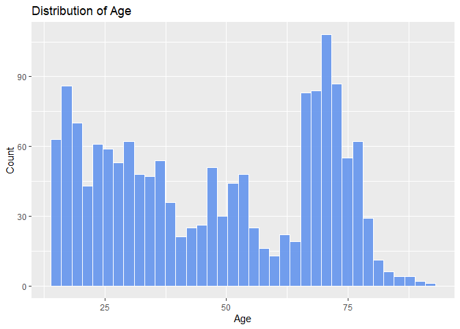<!-- -->

A large portion of individuals who participated in the survey are
elderly, as can be seen from the Age distribution that peaks around late
60’s to mid 70’s. The surveyed is notably lacking in middle aged
respondents. Gender is split rather equally. The vast majority of
respondents were white and had an income ranging from \$50,000 to
\$99,999.

### Univariate Analysis

Below follows univariate analysis for 3 crucial features in the model.

``` r
techBar
```

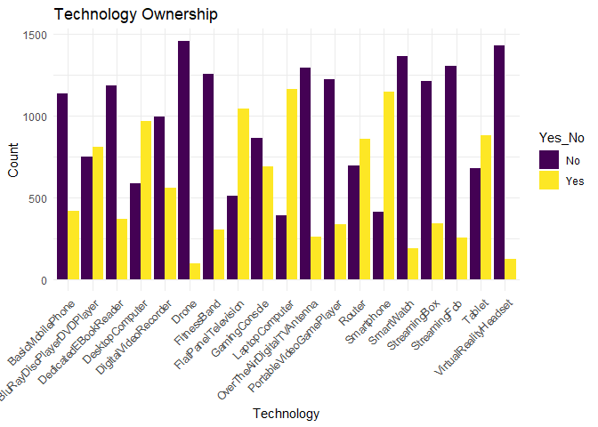<!-- -->

Plotting technology ownership shows that the majority of respondents
own:

- DVD players
- Desktop Computers
- Flat Panel Televisions
- Laptop Computers
- Routers
- Smartphones
- Tablet

``` r
watchBar
```

<!-- -->

A plot of watch time of different forms of entertainment on different
devices show TV’s reign supreme, being the most used device to watch
sport, movies and TV shows. Computer’s/Laptop’s are the second most used
device across all entertainment, followed by smartphones and lastly
tablets. This result indicates that the type of entertainment does not
drastically impact the devices used.

``` r
subBar
```

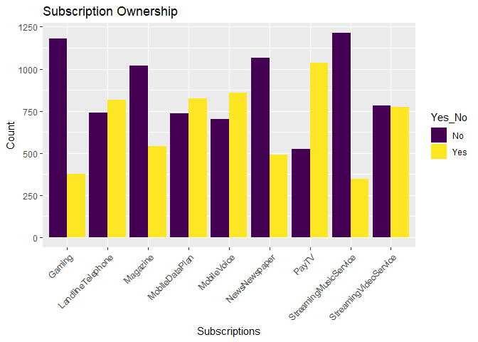<!-- -->

Plotting household subscriptions shows that most individuals are
subscribed to the following services:

- Landline Telephone
- Mobile data plan
- Mobile Voice
- PayTV

Notably, video streaming services are nearly 50/50.

### Bivariate Analysis

The density plots below shows a breakdown of individuals who would
upgrade their internet package based on age, technology ownership and
subscription ownership.

``` r
ageDensityPlot
```

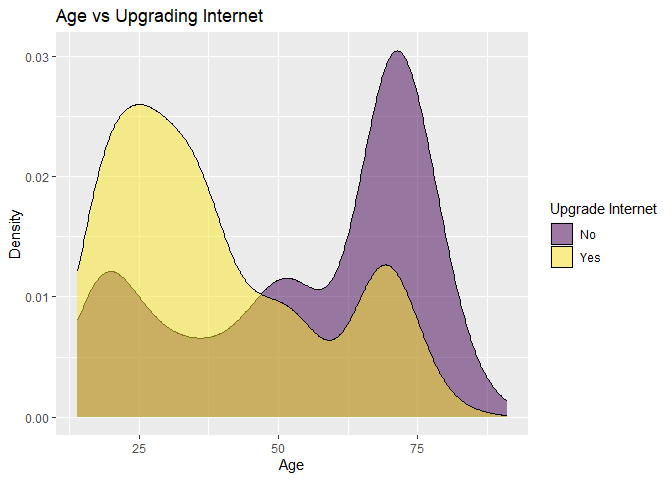<!-- -->

What is immediately clear from the graph above is the fact that younger
people are far more likely to upgrade their internet speed. This peaks
at around age 25. A large proportion of people who said no to upgrading
their internet package are elderly.

``` r
techDensityPlot
```

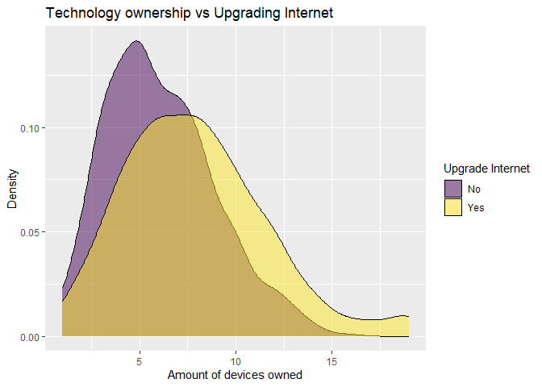<!-- -->

The density plot investigating technology ownership shows that the
majority of people who said no, own few devices. In this survey atleast,
people who own more devices are more likely to upgrade their internet
speed.

``` r
subDensityPlot
```

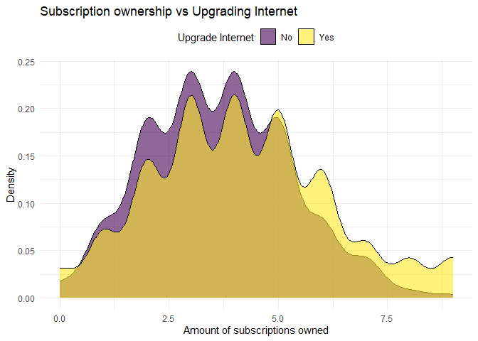<!-- -->

A similar story holds for subscriptions, with people who own more
subscription are more likely to say yes.

The violin charts below shows a breakdown of people who are willing to
pay for upgraded internet based on different forms of entertainment and
the devices used to view them.

``` r
plotViolins(movie_BIdf, "Watch Time per device vs Upgrading Internet - Movies")
```

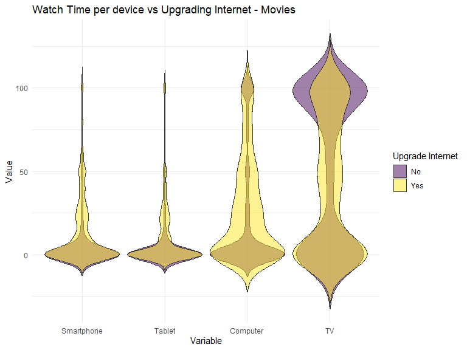<!-- -->

``` r
plotViolins(tv_BIdf, "Watch Time per device vs Upgrading Internet - TV Shows")
```

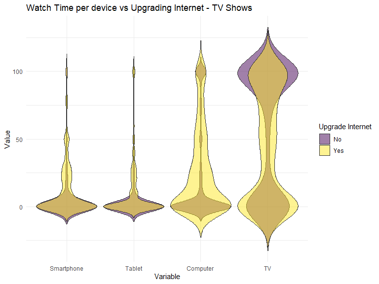<!-- -->

``` r
plotViolins(sport_BIdf, "Watch Time per device vs Upgrading Internet - Sport")
```

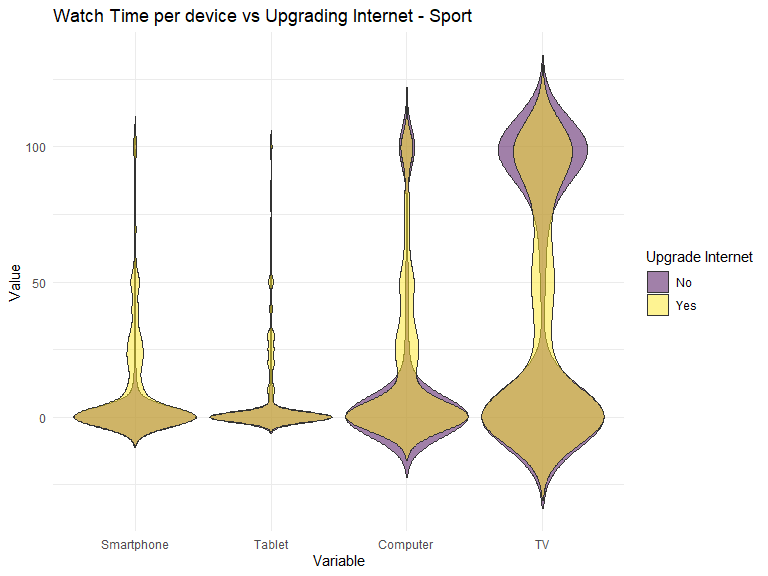<!-- -->

Individuals who spent a significant amount of time watching Movies and
TV Shows on a computer are more likely to be willing to upgrade.
However, individuals who spend a large amount of consuming any form of
entertainment on TV, are much more likely to say no to an upgrade.
Smartphones and tablets provide less clear results for all forms of
entertainment.

## Modeling

In order to predict which individuals are willing to upgrade their
internet package I fit a Random Forest model. The target variable is the
encoded as a 1 if the individual answered that they are willing to
upgrade and 0 if they are not. A total of 89 features are used. The
model is fitted using the ranger package.

### Baseline Model

The default model in the ranger package is used as the baseline model.

``` r
paste("OOB Prediction Error:", round(rf1$prediction.error,3))
```

    ## [1] "OOB Prediction Error: 0.29"

``` r
paste("RMSE:", round(sqrt(rf1$prediction.error),3))
```

    ## [1] "RMSE: 0.539"

``` r
rf1$confusion.matrix
```

    ##     predicted
    ## true   0   1
    ##    0 479 173
    ##    1 189 407

The baseline model reports an Out-of-Bag (OOB) prediction error of 29%
which equates to an Root Mean Squared Error (RMSE) of 0.539. This is a
decent accuracy for a model with no tuning, which is a strength of
Random Forests as stated earlier. The confusion matrix shows that the
model has no preference for a certain type of mistake, with 173 false
negatives and 189 false positives.

I plot baseline model Mean Squared Error (MSE) for an increasing number
of trees in the figure below.

``` r
treePlot
```

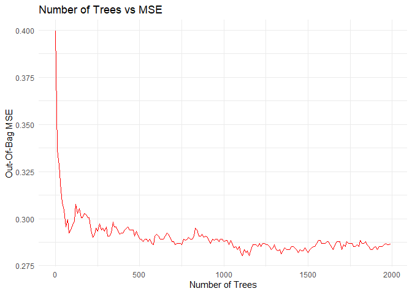<!-- -->

For a small number of trees a drastic reduction in MSE is observed. This
reduction seems to stabilise at around 500 trees. Although a lower MSE
is possible by fitting more trees, this can cause issues. Using more
trees increases the complexity of the model and thus increases the
computational power required. Simply put, the reduction in errors do not
justify the additional resources invested. Additionally, using a higher
number of trees increases the chance that the model is overfitted, which
means performance will suffer when introducing new data. I therefore
continue with 500 trees in subsequent modeling.

### Hyperparatemer tuning

Hyperparameter tuning was done using a standard grid search. In essence,
each parameter is given a range in which the search will take place. A
grid of all possible parameter combinations is created and models are
iteratively fitted for every combination and the model with the lowest
RMSE is selected.

``` r
TuneResult
```

|   X | mtry | min.node.size | replace | sample.fraction | splitrule | predError |      rmse |
|----:|-----:|--------------:|:--------|----------------:|:----------|----------:|----------:|
|   1 |    8 |             7 | TRUE    |               1 | gini      | 0.2732372 | 0.5227209 |

The table above shows the best model found. The grid search yielded only
a marginal improvement, with an 0.273 OOB prediction error, which
equates to an RMSE 0.523. This is a 0.016 RMSE improvement from the
baseline model.

### Final Model

The best model found by the grid search above is fitted.

``` r
paste("OOB Prediction Error:", round(bestmod1$prediction.error,3))
```

    ## [1] "OOB Prediction Error: 0.273"

``` r
paste("RMSE:", round(sqrt(bestmod1$prediction.error),3))
```

    ## [1] "RMSE: 0.523"

``` r
bestmod1$confusion.matrix
```

    ##     predicted
    ## true   0   1
    ##    0 494 158
    ##    1 183 413

As stated above, this model gives marginally better predictions. The
confusion matrix once again shows that the model has no preference for a
certain type of mistake.

The next step is to use the model to run predictions on both the
training and testing set. Note however that that the confusion matrix
and error rates for the training set predictions are different. This is
due to the fact that OOB errors are calculated at each individual tree,
based on predictions that tree makes on data not used to build it, and
then aggregated across trees. Predictions across the training set,
utilise all trees and all data, and merely counts the number of
observations the model correctly predicted.

``` r
conMat_train
```

    ## Confusion Matrix and Statistics
    ## 
    ##           Reference
    ## Prediction   0   1
    ##          0 650  18
    ##          1   2 578
    ##                                           
    ##                Accuracy : 0.984           
    ##                  95% CI : (0.9754, 0.9902)
    ##     No Information Rate : 0.5224          
    ##     P-Value [Acc > NIR] : < 2.2e-16       
    ##                                           
    ##                   Kappa : 0.9678          
    ##                                           
    ##  Mcnemar's Test P-Value : 0.0007962       
    ##                                           
    ##             Sensitivity : 0.9969          
    ##             Specificity : 0.9698          
    ##          Pos Pred Value : 0.9731          
    ##          Neg Pred Value : 0.9966          
    ##              Prevalence : 0.5224          
    ##          Detection Rate : 0.5208          
    ##    Detection Prevalence : 0.5353          
    ##       Balanced Accuracy : 0.9834          
    ##                                           
    ##        'Positive' Class : 0               
    ## 

``` r
conMat_test
```

    ## Confusion Matrix and Statistics
    ## 
    ##           Reference
    ## Prediction   0   1
    ##          0 123  39
    ##          1  50  98
    ##                                           
    ##                Accuracy : 0.7129          
    ##                  95% CI : (0.6591, 0.7626)
    ##     No Information Rate : 0.5581          
    ##     P-Value [Acc > NIR] : 1.476e-08       
    ##                                           
    ##                   Kappa : 0.4228          
    ##                                           
    ##  Mcnemar's Test P-Value : 0.2891          
    ##                                           
    ##             Sensitivity : 0.7110          
    ##             Specificity : 0.7153          
    ##          Pos Pred Value : 0.7593          
    ##          Neg Pred Value : 0.6622          
    ##              Prevalence : 0.5581          
    ##          Detection Rate : 0.3968          
    ##    Detection Prevalence : 0.5226          
    ##       Balanced Accuracy : 0.7132          
    ##                                           
    ##        'Positive' Class : 0               
    ## 

Predictions on the training set shows an accuracy of 98.4%. Positive
values are correctly predicted 99.7% of the time and negative values
96.9% of the time. However these results are not representative since
the model has seen this data before. Predictions on testing data tend to
be closer to the OOB accuracy and thus more representative.

The final model has a 71.29% accuracy when predicting data it has not
seen before. It accurately predicts 71.11% of individuals who would be
willing to upgrade their internet package and 71.53% of individuals who
would not. The confusion matrix also shows that the model has no
preference for making a certain type of mistake.

In order to interpret the model I turn the relative variable importance.
Simply put, variable importance is calculated by counting how many times
a variable is used for splitting a node. Variables that carry more
weight in splitting the data, will appear more when selecting a variable
from a subset of features at each splitting point. These results are
shown in the figure below.

``` r
ImportancePlot
```

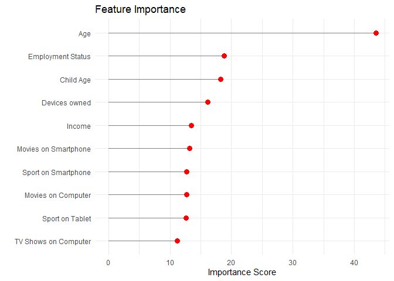<!-- -->

Age is by far the most important predictor, followed by other
demographic factors like child’s age, employment status and income. In
terms of media consumption, the amount of devices owned plays a large
role. Several features involving entertainment on specific devices also
show up in the top 10 features. However, in order to properly interpret
these features one needs to compare them with the exploratory data
analysis done earlier.

## Conclusion

As stated above, age seems to be the most important feature. Its clear
from the EDA that young people are more likely to upgrade their
internet. Thus if this model were to be used for targeted advertising,
these ads should focus on people in their 20’s. Technology ownership is
another important feature, and as the EDA showed, the marketing efforts
should be focused on individuals with more than 8 devices in their
household. As for which the devices to target, the model, together with
the EDA, shows that individuals who enjoy their entertainment on
smartphones, computers and tablets should be targeted.

In conclusion, the Random Forest was able to predict what individuals
would be willing to upgrade their internet package with a 71.28%
accuracy. The model was balanced in its errors, as it did not perform
worse for a particular group. An analysis of variable importance,
together with the bivariate analysis of features showed that marketing
should be directed to young individuals, who own several devices and
prefer to watch their entertainment on devices that are not televisions.
