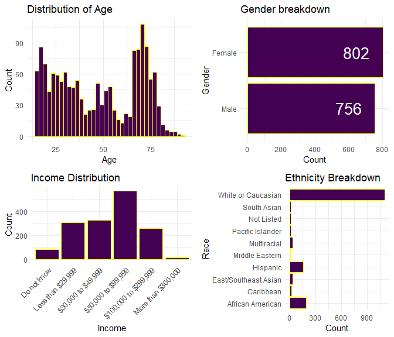
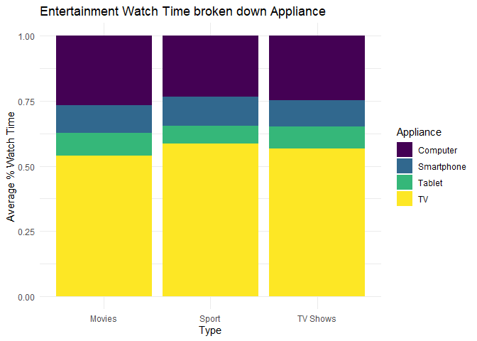
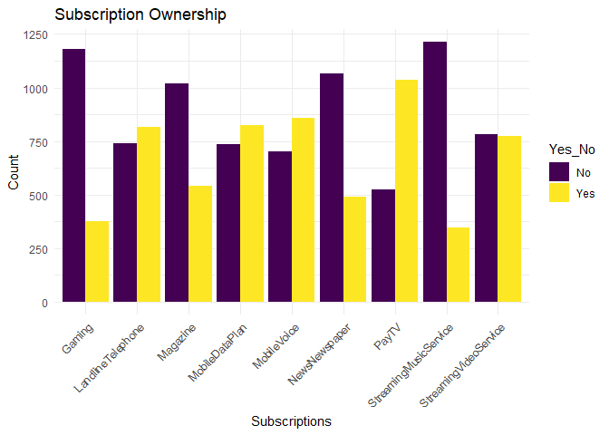
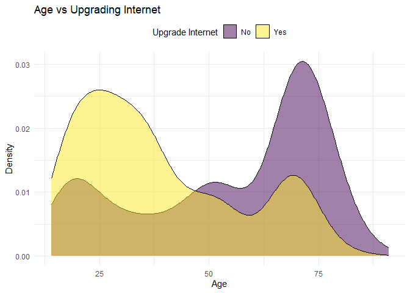
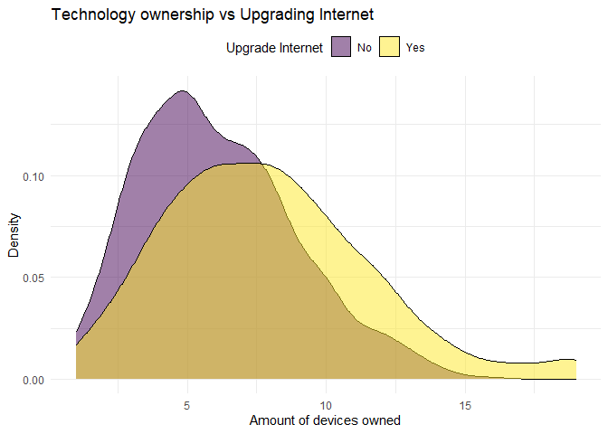

Data Science 871 project
================

## Media Consumption and Willingness to upgrade internet package.

The purpose of this project is to use survey data in order to determine
which factors are important predictors of whether individuals would be
willing to upgrade their internet packages. All code and functions are
stored under the “code” folder. This readme is solely for visualization
of data and results.

Code files:

## Data loading and cleaning

The data set contains survey responses from 2131 individuals regarding
demographic factors (age, sex, race, ect.), the types of apps they use,
time spent on different devices, preferred type of media, and other
issues regarding media consumption. I restrict this data set to include
only responses from individuals that have internet access.

The features can be broadly broken down into 6 categories, namely
demographic factors, technology owned by individuals, device usage, app
usage, user subscriptions and lastly, what individuals’ preferred form
of entertainment are.

``` r
NAs <- 0
for (i in 1:nrow(appDF)) {
    if (any(appDF[i,] == "#NULL!") == TRUE) {  #Checking how many users did not answer this question
        NAs <- NAs + 1
    }
}
NAs
```

    ## [1] 412

Under closer inspection it would appear that a total of 412 survey
respondents did not answer the question regarding app usage. Thus, for
now, I exclude this feature from further analysis. Additionally, I
exclude any individuals who do not have an internet connection as they
serve no purpose in determining the target variable of upgrading
internet.

\##Target Variable The target variable is turned into a factor variable
indicating a 1 if they are willing to upgrade their internet package and
a 0 if they are not.

``` r
Q29 <- masterDF[,151]

UpgradeInternet <- ifelse(Q29 == "I am not willing to pay more for faster download speeds as my current speed is sufficient for my needs" |
                  Q29 == "I prefer faster speed but I am unwilling to pay more than I already do", 0, 1)
UpgradeInternet <- as.factor(UpgradeInternet)
head(UpgradeInternet)
```

    ## [1] 1 1 1 0 1 1
    ## Levels: 0 1

``` r
summary(UpgradeInternet)
```

    ##   0   1 
    ## 814 744

In total 814 respondents indicated that they will not be willing to
upgrade their internet package, while 744 respondents would.

## Exploratory Data analysis

### Demographics

Below are breakdowns of the demographic factors of the dataset.

``` r
demogPlot
```

<!-- -->

A large portion of individuals who participated in the survey are
elderly, as can be seen from the Age distribution that peaks around late
60’s to mid 70’s. The surveyed is notably lacking in middle aged
respondents. Gender is split rather equally. The vast majority of
respondents were white and had an income ranging from \$50,000 to
\$99,999.

### Univariate Analysis

Below follows univariate analysis for 3 crucial features in the model.

``` r
techBar
```

<!-- -->

Plotting technology ownership shows that the majority of respondents
own:

- DVD players
- Desktop Computers
- Flat Panel Televisions
- Laptop Computers
- Routers
- Smartphones
- Tablet

``` r
watchBar
```

<!-- -->

A plot of watch time of different forms of entertainment on different
devices show TV’s reign supreme, being the most used device to watch
sport, movies and TV shows. Computer’s/Laptop’s are the second most used
device across all entertainment, followed by smartphones and lastly
tablets. This result indicates that the type of entertainment does not
drastically impact the devices used.

``` r
subBar
```

<!-- -->

Plotting household subscriptions shows that most individuals are
subscribed to the following services:

- Landline Telephone
- Mobile data plan
- Mobile Voice
- PayTV

Notably, video streaming services are nearly 50/50.

### Bivariate Analysis

``` r
ageDensityPlot
```

<!-- -->

``` r
techDensityPlot
```

<!-- -->

``` r
subDensityPlot
```

<!-- -->

``` r
plotViolins(movie_BIdf, "Watch Time per device vs Upgrading Internet - Movies")
```

<!-- -->

``` r
plotViolins(tv_BIdf, "Watch Time per device vs Upgrading Internet - TV Shows")
```

<!-- -->

``` r
plotViolins(sport_BIdf, "Watch Time per device vs Upgrading Internet - Sport")
```

<!-- -->

``` r
rf1$prediction.error
```

    ## [1] 0.2900641

``` r
rf1$confusion.matrix
```

    ##     predicted
    ## true   0   1
    ##    0 479 173
    ##    1 189 407

``` r
treePlot
```

<!-- -->

``` r
Top10_models[1,]
```

    ##   X mtry min.node.size replace sample.fraction splitrule predError      rmse
    ## 1 1    8             7    TRUE               1      gini 0.2732372 0.5227209

``` r
ImportancePlot
```

<!-- -->
